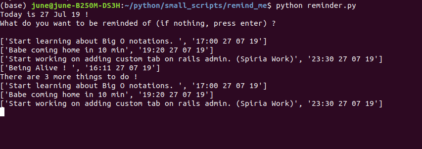

# Remind Me
Simple reminder script using python lib. 

Prerequisites

- Python 3.7.3

```
git clone
python reminder.py
```

It will save the task and time in csv file `reminded_me.csv`. Remind you by opening up a default broswer with task written in google search bar.




